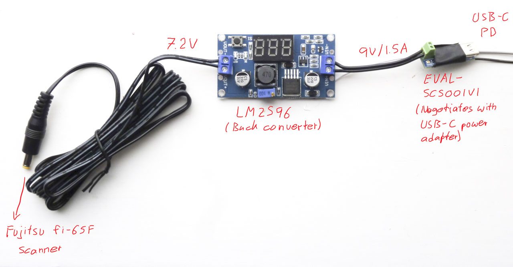

Introduction
============

When traveling to Sweden, I forgot the power adapter of the my little
Fujtsu fi-65F scanner in Berlin. So I created a replacement power
adapter that can be supplied with USB Power Delivery.

This power adapter can easily be adjusted for other devices.

Parts
=====

  * [EVAL-SCS001V1][1]: Board breaking out the [STUSB4500][2] USB PD
    controller
    
    It needs to be programmed to output 9V, for example using the
    [STSW-STUSB002][4] GUI.
    
  * [DollaTek LM2596][3]: Board breaking out the [LM2596][3] buck
    converter
    
  * Tensility International Corp’s [CA-2195][5]: Cable with barrel
    plug (1.7 mm ID, 4.75 mm OD, 9.5 mm depth)
    
    Polarity: ⊖⎯⎯⎯(⋅⎯⎯⎯⊕
  
  * 4 M2×6 screws
  
  * Enclosure 3D printed from the STLs in this repository (designed
    with Rhino 3D): With the outside surfaces facing the bed, *no
    support* is needed when FDM printing

Wiring
======

License
=======

Except where noted otherwise, files are licensed under the WTFPL.

Copyright © 2022 [Felix E. Klee](felix.klee@inka.de)

This work is free. You can redistribute it and/or modify it under the terms of
the Do What The Fuck You Want To Public License, Version 2, as published by Sam
Hocevar. See the COPYING file for more details.

[1]: https://www.st.com/en/evaluation-tools/eval-scs001v1.html
[2]: https://www.st.com/en/interfaces-and-transceivers/stusb4500.html
[3]: https://www.amazon.se/-/en/gp/product/B099DPD1SH
[4]: https://www.st.com/en/embedded-software/stsw-stusb002.html
[5]: https://www.digikey.se/en/products/detail/tensility-international-corp/CA-2195/568585
